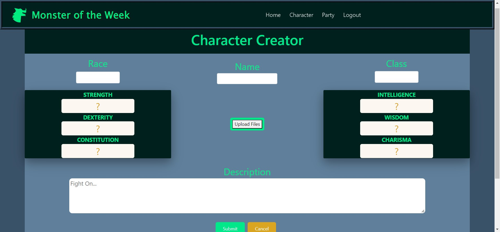
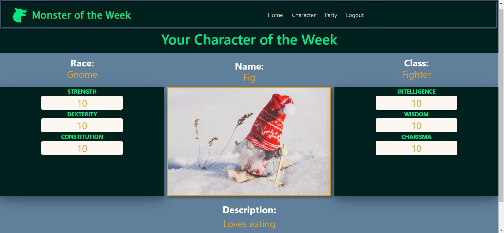
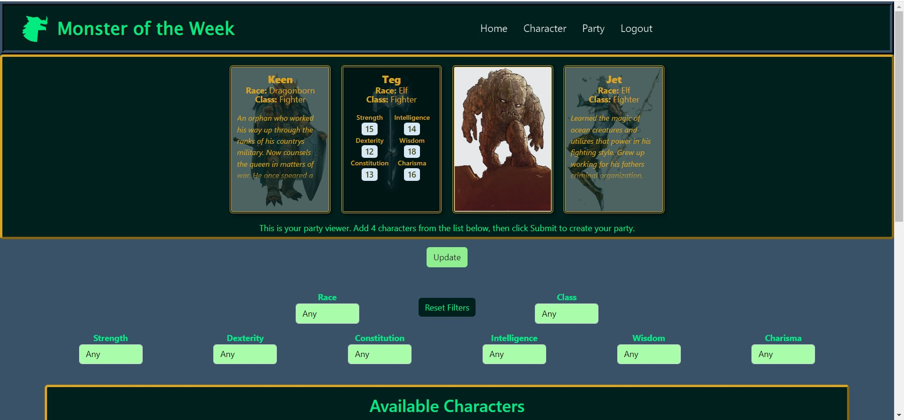

# Monster of the Week
Monster of the Week is a social media web game where users can create a Dungeons & Dragons 5th Edition (D&D 5e) character every week to join in the fight against an opponent chosen from the Monster Manual. After character creation, a user can build a party of up to four adventurers to face off against the monster. By building a party, the user is voting for the party they believe is best suited to overcome the threat, and the party with the most votes when the timer runs out is declared the victor.

This project was created using Java/Spring Boot and PostgreSQL for the backend server and Vue.js for the frontend SPA as the Final Capstone project at Tech Elevator. 
Project partners: 
- [kaylaspano1211](https://github.com/kaylaspano1211)
- [MiltonKrauss](https://github.com/MiltonKrauss)
- [bgrover8](https://github.com/bgrover8) 

## Character Creation
Every week, a user is able to create **one** character using the [D&D API](https://www.dnd5eapi.co/) to access the Systems Reference Document (SRD) rules for D&D 5e. 
- A character's six ability scores (Strength, Dexterity, Constitution, Intelligence, Wisdom, Charisma) are assigned randomly as though three 6-sided dice were rolled, ranging the scores from `3` to `18`.
- The user chooses their race and adventuring class from the options available in the SRD.
- The user can upload a custom image of their character (Hosted by [Cloudinary](https://cloudinary.com/)).
- The user can write a detailed description of their character.
### Screenshots

## Party Creation
A user is able to pick a party of up to four adventurers from the characters created by themself and other users.
- Users can filter characters based on Class, Race, or Ability Scores.
- Users can see moderator approved images of characters and read descriptions.
- Users can can add or update up to four party members up until the deadline.
- Users can flag a character for inappropriate content for moderator review
### Screenshots

## Moderation
- Moderators can approve character images
- Moderators can review characters to ensure they meet content standards
- Moderators can ban other users

## Attribution
This project is intended for educational purposes only. Certain images have been used from the [Dungeons & Dragons Media Gallery](https://dnd.wizards.com/media-gallery). I do not claim to own these images, and will readily remove them on request.

This work includes material taken from the System Reference Document 5.1 (“SRD 5.1”) by Wizards of the Coast LLC and available at [https://dnd.wizards.com/resources/systems-reference-document](https://dnd.wizards.com/resources/systems-reference-document). The SRD 5.1 is licensed under the Creative Commons Attribution 4.0 International License available at [https://creativecommons.org/licenses/by/4.0/legalcode](https://creativecommons.org/licenses/by/4.0/legalcode).